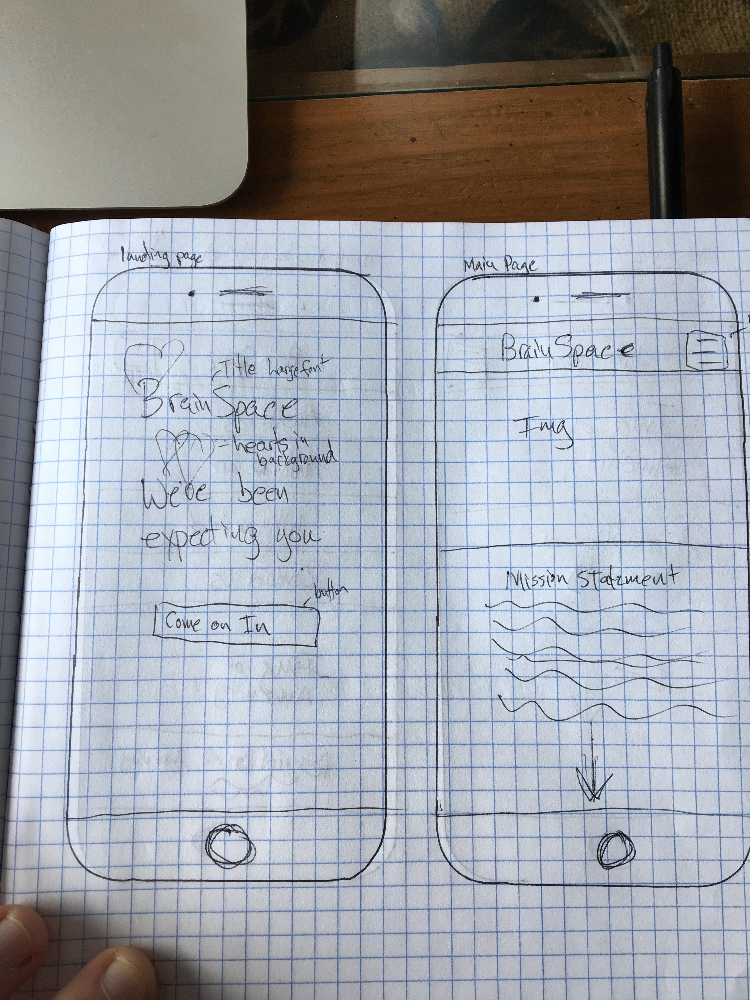
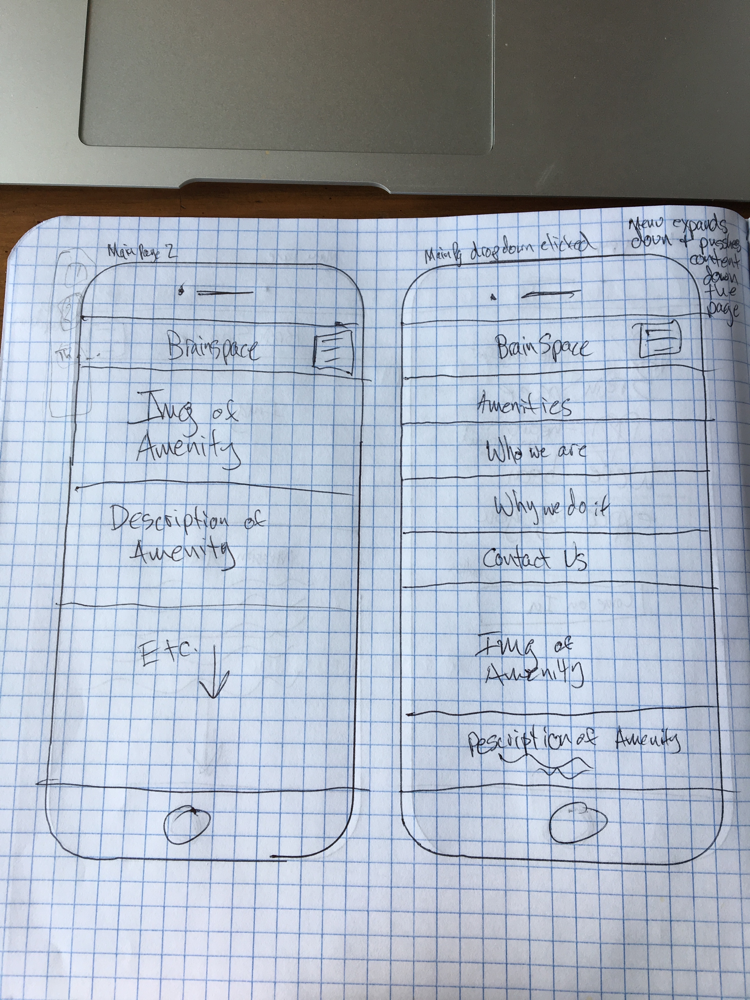

# _BrainSpace_

#### _Project mimicking what it would be like to be a freelance developer._

#### By _**Isaac Shoman**_

## Description

_Enter Text Here_

## Brainstorm Process

* I've decided to design the mobile platform first. Most people who are independent contractors/artists are constantly on the go. A solid mobile layout will be key to drawing in customers for the client.
* In looking at WeWork and TechSpace, they both have layouts that feature a lot of carousels/slideshows which promote flowing spaces and thought. I like the general idea of that, but I think having a whole page of slideshows is a little overpowering and doesn't guarantee the consumer will see everything you want them to see.
* I will base the color scheme on the colors depicted in the photos. Primarily the mint green in the first photo.
* A few of the photos have "love" as a theme. That is clearly important to the client. The site should express empathy and love for all people.

_Things to put on the site:_

* List Amenities
* Activities every Thursday
* Contact Us

Inspirations: WeWork and TechSpace webpages.

I have decided to go with single page flowing website as I believe this best illustrates the open and inviting nature of the client's space. Everything is there for you to see and experience without having to dig for it.

The rest of this project will be guided by the idea of openness and the desire for everything to be attractive, sleek, and efficient as per the client's wishes.

## Sketches

## Setup/Installation Requirements

* _Clone Repository to Desktop_
* _Open in Sketch_

## Known Bugs

_No known bugs_

## Support and Contact Details

_Please email me at isaac.shoman@gmail.com with any feedback!_

## Technologies Used

* _Sketch_

### License

*This website is licensed under an MIT License*

Copyright (c) 2018 **_Isaac Shoman_**
